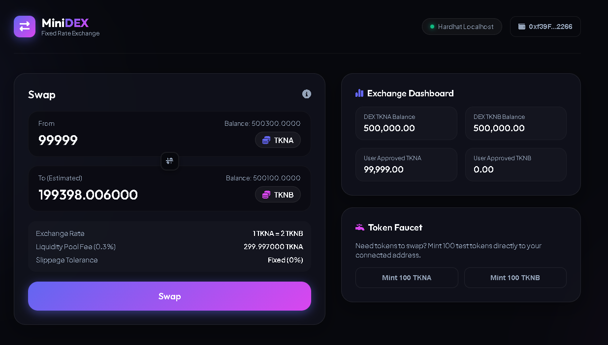
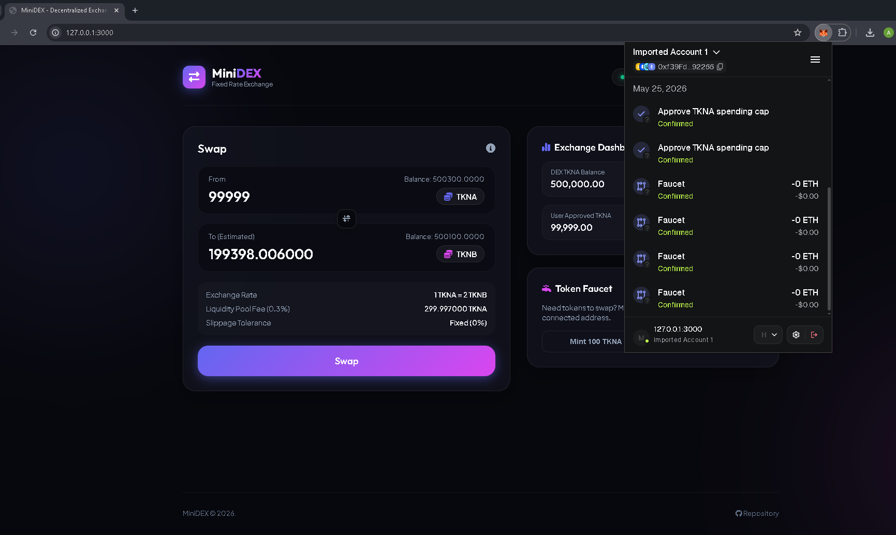

# MiniDEX

A mini decentralized exchange (DEX) designed to swap two ERC-20 tokens (Token A and Token B) using a fixed exchange rate, with a liquidity provider (LP) fee and a frontend interface.





---

## About the project
**MiniDEX** is a simplified decentralized exchange platform. It allows users to perform automatic and instant swaps of ERC-20 tokens directly from their Web3 wallet (such as MetaMask), without relying on intermediaries or centralized order books.

---

## Problem it solves
Traditional exchanges and centralized trading platforms act as custodians of your funds, charge high fees, require registration processes (KYC), and are vulnerable to hacks and censorship.
**MiniDEX** solves this by:
- **Maintaining user custody**: Transactions occur directly from wallet to wallet via smart contracts.
- **Removing intermediaries**: Exchange rules and rates are self-executed on-chain.
- **Ensuring transparency**: Contract code and liquidity balances are publicly auditable in real time.

---

## How it works
1. **Custom ERC-20 tokens**: The project implements two tokens: Token A (TKNA) and Token B (TKNB). Both tokens include a public faucet function to facilitate local testing.
2. **Exchange contract:**:
   - Manages liquidity for both tokens.
   - Applies a fixed conversion rate (1 Token A = 2 Token B).
   - Simulates a basic Uniswap-like model by charging a 0.3% fee on the input token.
   - Emits a Swap event for every successful transaction.
3. **Swap mechanism**:
   - **Token A to Token B**: If you send `100 TKNA`, a 0.3% fee is deducted (`0.3 TKNA`). The remaining amount (`99.7 TKNA`) is multiplied by 2, giving you exactly `199.4 TKNB`.
   - **Token B to Token A**: If you send `200 TKNB`, a 0.3% fee is deducted (`0.6 TKNB`). The remaining amount (`199.4 TKNB`) is divided by 2, giving you exactly `99.7 TKNA`.

---

## How to run

Follow these steps to compile, test, and run the application locally.

### 1. Clone the repository and install dependencies:
```bash
npm install
```

### 2. Compile the Solidity smart contracts:
```bash
npx hardhat compile
```

### 3. Run the unit test suite:
```bash
npx hardhat test
```
*The tests verify swap functionality, correct fee deduction, changes in user/contract balances, and rejection of invalid transactions.*

### Start a local development node:
```bash
npx hardhat node
```
*This will start a local test blockchain at http://127.0.0.1:8545 with 20 pre-funded accounts, each with 10,000 ETH.*

### 5. Deploy the contracts to the local network:
In another terminal tab, run:
```bash
npx hardhat run scripts/deploy.js --network localhost
```
*This script deploys `TokenA`, `TokenB` and `Exchange`, transfers 500,000 tokens of each type as initial liquidity, and automatically generates the `frontend/config.js` file with the contract addresses.*

---

## Web3 Frontend
The project includes a minimalist, futuristic UI with **Glassmorphism** design and MetaMask support.

To open the interface:

1. Open the `frontend/index.html` file directly in your browser.
2. Connect your **MetaMask** wallet to the Hardhat local network:
   - RPC URL: `http://127.0.0.1:8545`
   - Chain ID: `31337`
   - Symbol: `ETH`
3. Import one of the private keys provided by `npx hardhat node` node into MetaMask to obtain local ETH.
4. Use the Token Faucet in the interface to claim your first `100 TKNA` or `100 TKNB`.
5. Approve and execute your swaps!

---

## Tech Stack
- **Solidity (v0.8.20)**: Language for writing smart contracts.
- **Hardhat**: Professional development environment for compiling, testing, and deploying contracts.
- **OpenZeppelin Contracts**: Industry standard for secure ERC-20 and access control implementations.
- **Ethers.js (v6)**: Library for interacting with the Ethereum blockchain from JavaScript.
- **HTML5, Vanilla CSS3 & Vanilla JavaScript**: For the responsive Web3 frontend with glassmorphic effects and real-time toast notifications.
